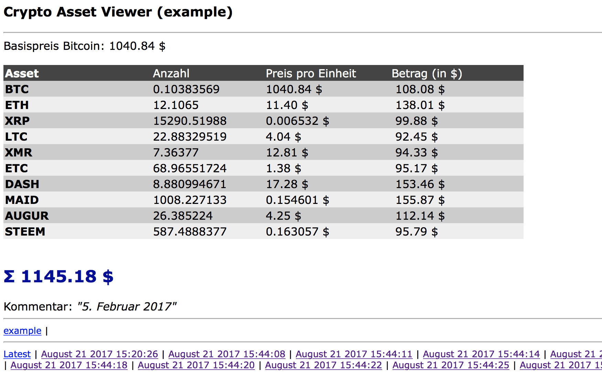

# CryptoAssetViewer
A simple PHP + TXT-file tool to manage and view own crypto assets. A alternative to an Excel table.

System requirements
-----

PHP-Enviroment like XAMPP. No MySQL database is required.